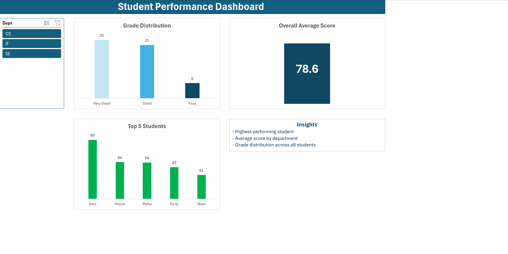

# Student Performance Dashboard

## Dashboard Preview

## Project Description
This project involved developing an interactive dashboard using Microsoft Excel to analyze student academic performance. The primary objective was to visualize key performance indicators across different departments including Computer Science (CS), Information Technology (IT), and Software Engineering (SE).

## Technical Features
* **Data Processing**: Applied data cleaning and transformation techniques to ensure dataset integrity.
* **Interactive Filtering**: Implemented Slicers to allow dynamic data exploration by department.
* **Key Metrics**: Automated visualization of GPA distribution, grade categories, and student rankings.

## Tools Used
* Microsoft Excel (Pivot Tables, Advanced Charting, Slicers)
* GitHub (Version Control)
